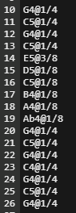
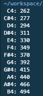

# C_The_Music
A pretty cool C program that converts textual piano notes into audio .wav files!

**To run the program:**

Simply type in "make" into the command line environment.
(The corresponding MAKEFILE has been structured to compile the combination of different files using just the make command)

To see the frequencies of the different keys within an octave, simply run ./notes.
This will print out the frequencies onto the console. Feel free to change the octave near the top of the notes.c file to see frequencies of keys in other octaves.

To get an audio .wav file, run the following command:
./synthesize song.wav < songs/song.txt

*^Replace the keyword "song" with the actual name of the song*
*A sample bday.wav file is already included along with the source files*

**Some relevant files:**

songs folder- Contains text files for songs written in musical notation

notes.c- prints frequencies (in Hz) of notes corresponding to an octave and outputs a WAV audio file that plays those notes

synthesize.c- Takes the texttual representation of notes of different songs and produces auditory sounds using the individual frequencies produced by each corresponding note in an octave.

The source code contains a MAKEFILE that has the code required to compile/run the the combination of multiple files together (so user does not need to individually compile each one/know the order, etc)

*Some accessory open source code imported from Harvard CS50*
